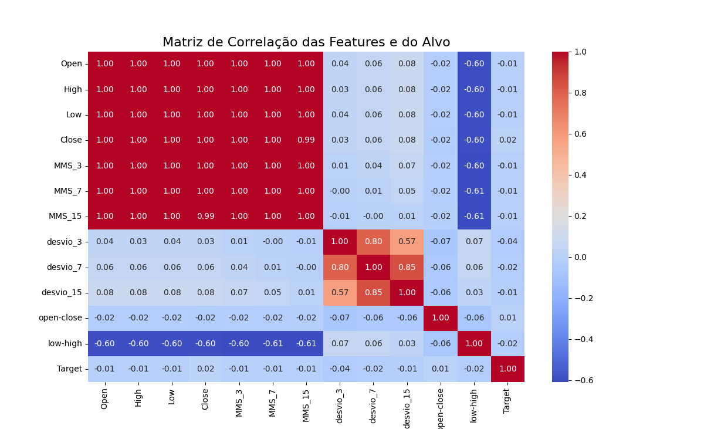
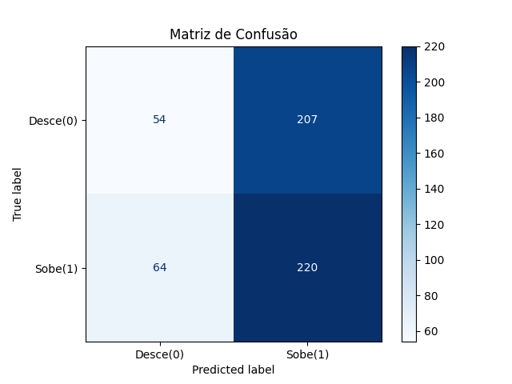

# Técnica Clássica 📈

## Visão Geral 

Modelo de Regressão Logística implementado para prever se o preço do dia seguinte sobe ou desce com base em diferentes features.

## Objetivos do Projeto 🎯

Realizar o pré-processamento de dados históricos de preço do BTC.

Aplicar engenharia de features para criar indicadores técnicos robustos (RSI, ATR, etc.).

Garantir a integridade do modelo, prevenindo vazamento de dados (data leakage) em séries temporais.

Treinar e avaliar o modelo de Regressão Logística.

Analisar a performance do modelo através da Matriz de Confusão e outras métricas.

Interpretar os coeficientes do modelo para entender quais features são mais influentes.

## Tecnologias Utilizadas
Python 3.x

Pandas para manipulação de dados.

Scikit-learn para treinamento do modelo e avaliação.

Matplotlib / Seaborn para visualização de dados.

## Metodologia ⚙️
O desenvolvimento do modelo seguiu um pipeline bem definido:

1. Coleta e Pré-processamento: 
Os dados históricos do Bitcoin (arquivo .csv) foram carregados, limpos e formatados. A coluna de data foi convertida para o tipo datetime e os dados foram ordenados cronologicamente.

2. Engenharia de Features: 
Para que o modelo pudesse analisar o comportamento do mercado, algumas features foram desenvolvidas a partir de médias móveis de curto e médio prazo.

3. Definição do Alvo e Prevenção de Data Leakage: 
O problema foi estruturado como uma classificação binária:

Alvo (Target): 1 se o Preço(Amanhã) > Preço(Hoje), e 0 caso contrário.

4. Treinamento do Modelo: 
O conjunto de dados foi dividido cronologicamente em 80% para treino e 20% para teste. As features foram padronizadas com StandardScaler e, em seguida, um modelo de LogisticRegression foi treinado.

## Resultados e Análise 📊

A primeira análise feita foi para a definição do Dataset. Optamos por um conjunto que englobasse os dados mais recentes possíveis, sendo estes retirados do site Kagle. Após isso, foram definidas algumas features que poderiam ajudar ele a prever as movimentações do mercado, como as médias móveis. Abaixo segue a matriz de correlação com as colunas do dataset.

Como é possível observar, existem algumas features que estão fortemente relacionadas umas com as outras COM VALOR 1.0, então optamos por tira-las, deixando dentre essas apenas a média móvel dos últimos 15 dias (MMS_15)

O modelo treinado foi avaliado no conjunto de teste, que corresponde a dados que o modelo nunca viu durante o treinamento.

A Matriz de Confusão abaixo resume a performance do modelo, mostrando os acertos e os tipos de erros cometidos.

**Acurácia**

50% → Porcentagem geral de acertos.

**Precisão**

52% → Das vezes que o modelo previu "Sobe", ele acertou.

**Recall**

77% → De todas as altas reais, o modelo identificou esta porcentagem.

## Conclusão 🏁

A partir da análise dos resultados, é possível concluir o resultado como esperado. O mercado de criptomoedas é conhecido por ser extremamente volátil, então naturalmente é difícil trabalhar com suas previsões. Junto a isso, utilizamos uma técnica de regressão considerada mais simplificada do que outras, justificando os valores calculados. Nesse caso, ele acabou tendendo para previsões positivas, muito provavelmente por que desde o lançamento do bitcoin, ele registrou muito mais médias positivas do que negativas.

# Trabalhos Relacionados 🔍

Em trabalhos relacionados foi possível identificar o uso de outros modelos de classificação para esse trabalho que se mostraram com bastante potencial, como o XGBClassifier. Além disso, é possível utilizar regressões de valor contínuo para tentar prever o preço exato do bitcoin no dia seguinte, diferentemente das classificações binárias de 'sobe ou desce'.

# Referências

Bitcoin Price Prediction using Machine Learning in Python .https://www.geeksforgeeks.org/machine-learning/bitcoin-price-prediction-using-machine-learning-in-python/

Predicting Bitcoin Market Trends with Enhanced Technical Indicator Integration and Classification Models. https://arxiv.org/html/2410.06935v1. 

Bitcoin price prediction using machine learning: An approach to sample dimension engineering. https://www.sciencedirect.com/science/article/pii/S037704271930398X?via%3Dihub#sec4

Agent-Based Single Cryptocurrency Trading Challenge. https://coling2025cryptotrading.thefin.ai/
