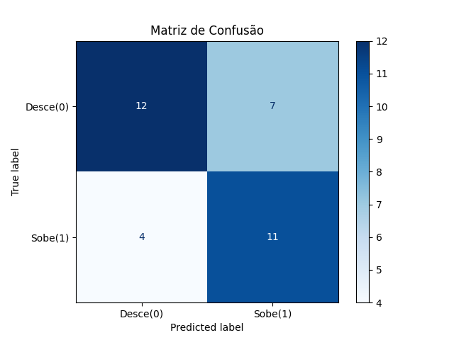

# Técnica Moderna 📈

## Visão Geral

Foi desenvolvido um algoritmo utilizando uma LLM especializada em analise de sentimento de notícias financeiras. O objetivo é prever se o preço do Bitcoin no dia seguinte irá subir ou descer com base no sentimento das manchetes de notícias do dia atual.

## Objetivos do Projeto 🎯

Realizar o pré-processamento dos dados históricos de preço do BTC e suas respectivas manchetes diárias.

Aplicar um modelo de PLN para inferir o sentimento de cada notícia.

Calcular um score médio de sentimento por dia e usá-lo para prever a movimentação de preço do dia seguinte.

Avaliar a performance da técnica moderna com métricas de classificação.

## Tecnologias Utilizadas

Python 3.x

Pandas para manipulação de dados

Transformers (HuggingFace) para análise de sentimento

Scikit-learn para métricas de avaliação

Matplotlib para visualização da matriz de confusão

## Metodologia ⚙️

1. Coleta e Pré-processamento:
Os dados foram lidos de um arquivo .json contendo o preço do Bitcoin e o resumo das notícias de cada dia. As manchetes foram limpas e as datas organizadas em ordem cronológica. O alvo (target) foi definido como 1 se o preço do dia seguinte for maior que o do dia atual, e 0 caso contrário.

2. Análise de Sentimento via LLM:
Utilizou-se o modelo "distilroberta-finetuned-financial-news-sentiment-analysis", treinado especialmente em notícias financeiras. Para cada manchete, o modelo retornou um sentimento (positivo ou negativo) com uma pontuação de confiança. Essa pontuação foi convertida em um score numérico (positivo ou negativo).

3. Agregação Diária e Previsão:
Os scores de sentimento foram agrupados por dia. Se a média diária fosse maior que zero, o modelo previa que o preço subiria no dia seguinte. Caso contrário, previa queda ou estabilidade.

4. Avaliação do Modelo:
As previsões foram comparadas com os dados reais utilizando métricas como acurácia, precisão, recall e matriz de confusão.

## Resultados e Análise 📊

A primeira análise feita foi para o tratamento de dados das notícias, visto que cada dia possui uma lista de N notícias com diferentes sentimentos. Após alguns testes, foi definido uma estruturação inicial com dois dataframes separados de preço e noticias para as manipulações de dados, que no final se juntaram em um dataframe. A predição foi feita com base apenas no teor sentimental das notícias, com o objetivo de além de inferir a capacidade do modelo de fazer esse tipo de análise, testar como o teor das notícias diárias afeta a volatilidade da moeda.

Foi decidido por utilizar um modelo já especializado e treinado com análise de sentimento para facilitar os testes. Para cada análise de notícia, atribuímos uma nova coluna 'sentiment_score' que transforma a análise 'positive/negative/neutral' em valores 1,0,-1 com o objetivo de fazer as análises de sentimento médio do dia.

Com a média diária dos sentimentos previstos pelo modelo, foi possível comparar com o 'target_real' para o cálculo das métricas. O 'Target_Real' foi calculado comparando o preço do dia seguinte com o atual. Logo, se a partir da análise de sentimento das notícias do dia o modelo prevesse um teor positivo, ele iria prever que o preço subiria, e a partir disso foi feita a comparação com os dados reais de volatilidade.

A Matriz de Confusão abaixo resume a performance do modelo, mostrando os acertos e os tipos de erros cometidos.

**Acurácia**
68% → O modelo acertou 68% das previsões gerais.

**Precisão**
61% → Das vezes em que o modelo previu "Sobe", ele acertou 61%.

**Recall**
73% → De todos os dias em que o preço realmente subiu, o modelo identificou corretamente 73%.

# Conclusão 🏁

A partir da análise dos resultados, é possível inferir que a técnica moderna baseada em LLMs demonstrou um bom desempenho mesmo sem usar dados numéricos de mercado. Isso mostra que o sentimento presente nas manchetes pode ser um sinal relevante para prever o comportamento do preço. Apesar disso, o modelo pode ser aprimorado ao combinar essa abordagem textual com indicadores técnicos e históricos quantitativos, formando uma solução híbrida mais precisa e robusta para a previsão em mercados financeiros voláteis como o de criptomoedas.